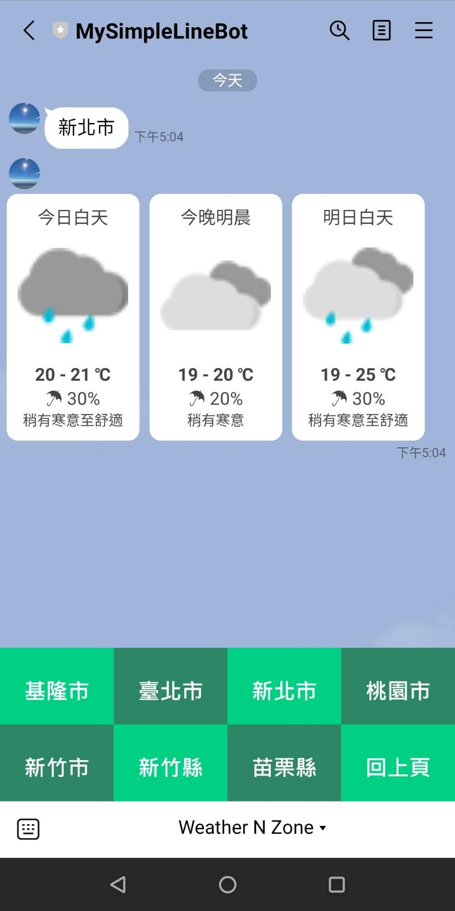
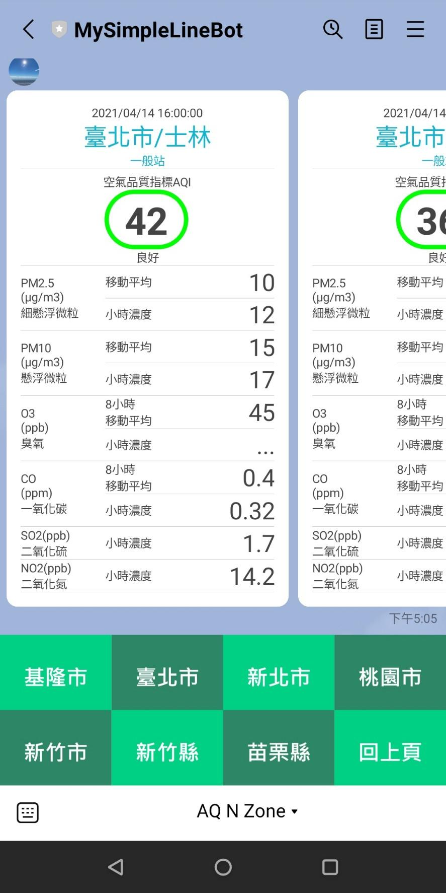

# simple-utility-api
features:
- backend of [simple-utility-app](https://github.com/ychsiao168/simple-utility-app), including:
  - Taiwan weather (powered by [CWB opendata](https://opendata.cwb.gov.tw/dist/opendata-swagger.html), api name: F-C0032-001 )  
    related source file: 
    - classes/weather.js
    - controllers/weather.js
  - Taiwan air quality (powered by [EPA opendata](https://data.epa.gov.tw/api/v1), api name: aqx_p_432 )  
    related source file:
    - classes/aqi.js
    - controllers/aqi.js
  - url keeper
  
- backend of MySimpleLineBot (ID: @497vtswq, or [qr code](https://page.line.me/497vtswq))  
  related source file: 
  - controllers/SimpleLineBot.js
  - controllers/linebot-messages.js
  - controllers/linebot-richmenu.js  
  
  

 
  
